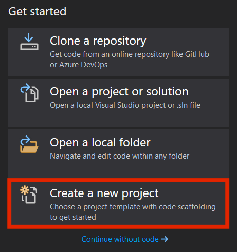
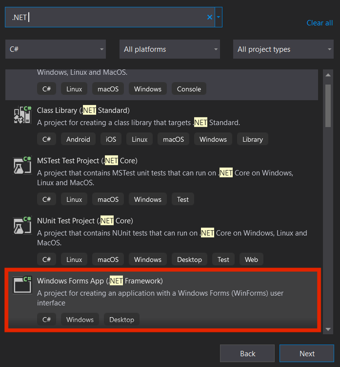
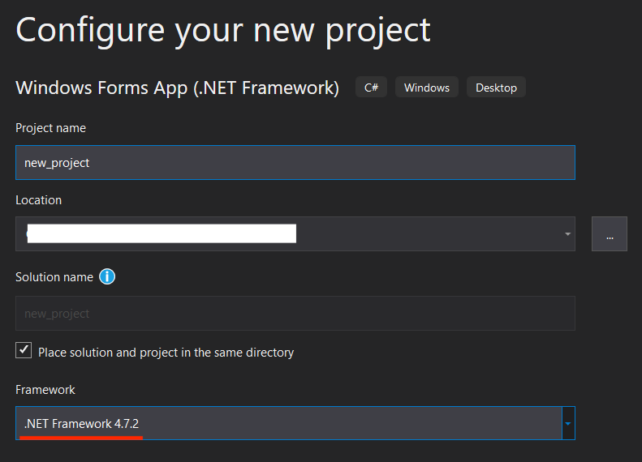
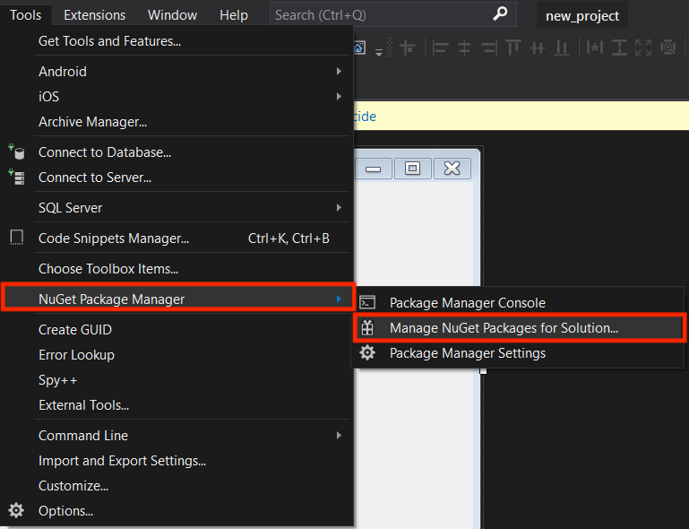
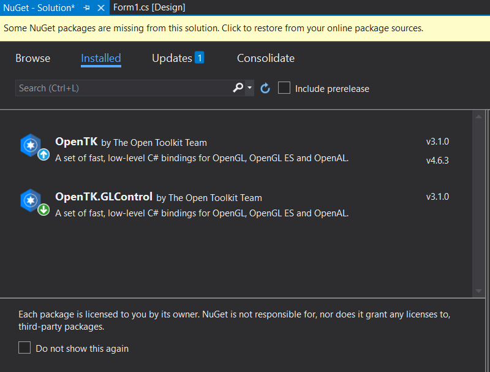
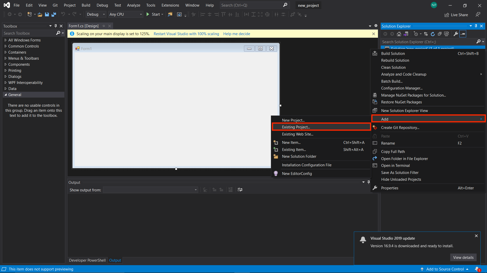
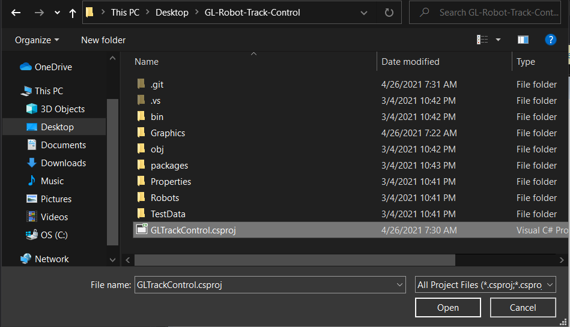
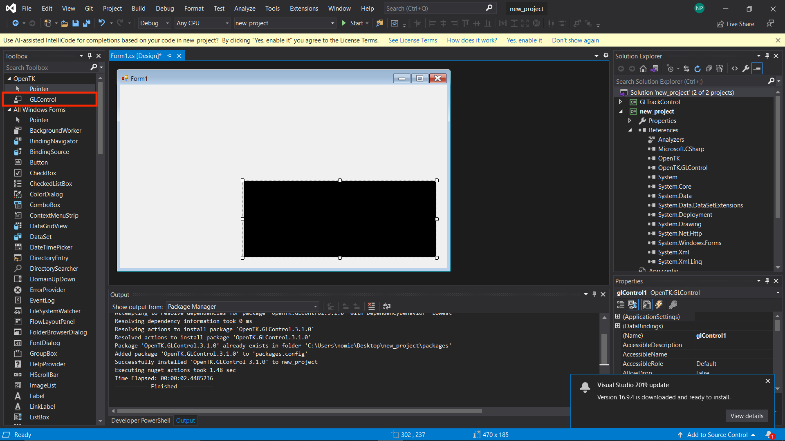

# Robot Tracking & Controlling .NET Framework & OpenGL

## Overview
A project that display real-time 3D object locations using C#, .NET Framework, OpenGl

Currently work with Tello drones. See demo on a desktop app that control drones [here](https://github.com/nhatduy227/Tello_waypoint)

## Requirement
- .NET Framework 4.7.2
- OpenTK 3.1.0
- OpenTK.GLControl 3.1.0

## How to use

I find it easy to use Visual Studio

### 1. Create C# .NET Framework project in Visual Studio

- .NET Framework 4.7.2







### 2. Download all required dependency

Use NuGet Package to download:

- OpenTK 3.1.0
- OpenTK.GLControl 3.1.0





### 3. Clone this repo
```shell
git clone https://github.com/AriNguyen/GL-Robot-Track-Control.git
```

### 4. Add this project to your new project




### 5. Create OpenTK GLControl object in your Form.cs


### 6. Add Logic to display OpenGL Graphcis

